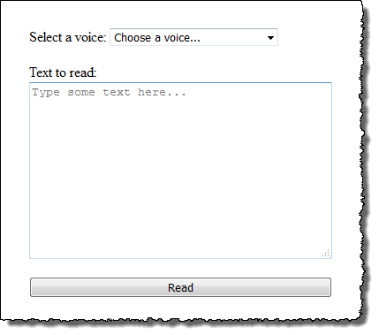

# AWS Polly - Speech to Text: NodeJS TypeScript

Conversion of the [AWS Polly Python web example](https://docs.aws.amazon.com/polly/latest/dg/examples-python.html) to NodeJS and TypeScript.



## Setup

Install the dependencies and setup your AWS credentials:

```bash
# Install dependencies
npm install

# Setup your AWS configuration as env vars after creating the .env file
cp .env.example .env
```

## Running

After completing the setup steps, you're ready to start the demo:

```bash
npm run dev
```

Navigate to [http://localhost:8000](http://localhost:8000)